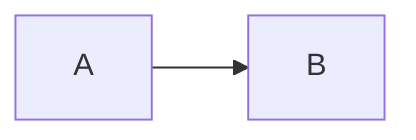

---
tags:
    - demo
id: ""
created: 2020-03-26T13:51:27.743Z
modified: 2020-03-26T14:27:57.864Z
---
# Diagrams 

Mermaid:



PlantUML:

```plantuml
A -> B
```

Echarts:

```echarts
{"xAxis":{"type":"category","boundaryGap":false,"data":["Mon","Tue","Wed","Thu","Fri","Sat","Sun"]},"yAxis":{"type":"value"},"series":[{"data":[820,932,901,934,1290,1330,1320],"type":"line","areaStyle":{}}]}
```

Wavedrom:

```wavedrom
{"signal":[{"name":"clk","wave":"p......"},{"name":"bus","wave":"x.34.5x","data":"head body tail"},{"name":"wire","wave":"0.1..0."}]}
```

Vega:

```vega
{
  "$schema": "https://vega.github.io/schema/vega/v5.json",
  "width": 500,
  "height": 200,
  "padding": 5,

  "data": [
    {
      "name": "table",
      "values": [
        {"x": 0, "y": 28, "c": 0}, {"x": 0, "y": 55, "c": 1},
        {"x": 1, "y": 43, "c": 0}, {"x": 1, "y": 91, "c": 1},
        {"x": 2, "y": 81, "c": 0}, {"x": 2, "y": 53, "c": 1},
        {"x": 3, "y": 19, "c": 0}, {"x": 3, "y": 87, "c": 1},
        {"x": 4, "y": 52, "c": 0}, {"x": 4, "y": 48, "c": 1},
        {"x": 5, "y": 24, "c": 0}, {"x": 5, "y": 49, "c": 1},
        {"x": 6, "y": 87, "c": 0}, {"x": 6, "y": 66, "c": 1},
        {"x": 7, "y": 17, "c": 0}, {"x": 7, "y": 27, "c": 1},
        {"x": 8, "y": 68, "c": 0}, {"x": 8, "y": 16, "c": 1},
        {"x": 9, "y": 49, "c": 0}, {"x": 9, "y": 15, "c": 1}
      ],
      "transform": [
        {
          "type": "stack",
          "groupby": ["x"],
          "sort": {"field": "c"},
          "field": "y"
        }
      ]
    }
  ],

  "scales": [
    {
      "name": "x",
      "type": "band",
      "range": "width",
      "domain": {"data": "table", "field": "x"}
    },
    {
      "name": "y",
      "type": "linear",
      "range": "height",
      "nice": true, "zero": true,
      "domain": {"data": "table", "field": "y1"}
    },
    {
      "name": "color",
      "type": "ordinal",
      "range": "category",
      "domain": {"data": "table", "field": "c"}
    }
  ],

  "axes": [
    {"orient": "bottom", "scale": "x", "zindex": 1},
    {"orient": "left", "scale": "y", "zindex": 1}
  ],

  "marks": [
    {
      "type": "rect",
      "from": {"data": "table"},
      "encode": {
        "enter": {
          "x": {"scale": "x", "field": "x"},
          "width": {"scale": "x", "band": 1, "offset": -1},
          "y": {"scale": "y", "field": "y0"},
          "y2": {"scale": "y", "field": "y1"},
          "fill": {"scale": "color", "field": "c"}
        },
        "update": {
          "fillOpacity": {"value": 1}
        },
        "hover": {
          "fillOpacity": {"value": 0.5}
        }
      }
    }
  ]
}
```

Vega-lite:

```vega-lite
{
  "$schema": "https://vega.github.io/schema/vega-lite/v4.json",
  "description": "A simple bar chart with embedded data.",
  "data": {
    "values": [
      {"a": "A", "b": 28}, {"a": "B", "b": 55}, {"a": "C", "b": 43},
      {"a": "D", "b": 91}, {"a": "E", "b": 81}, {"a": "F", "b": 53},
      {"a": "G", "b": 19}, {"a": "H", "b": 87}, {"a": "I", "b": 52}
    ]
  },
  "mark": "bar",
  "encoding": {
    "x": {"field": "a", "type": "ordinal"},
    "y": {"field": "b", "type": "quantitative"}
  }
}

```
